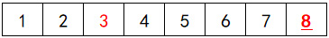
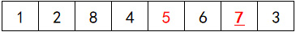
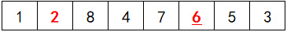
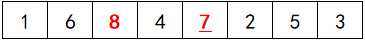
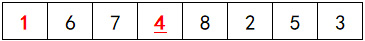
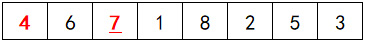
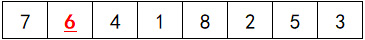
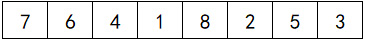

# 算法原理
费雪耶茨算法（Fisher-Yates shuffle），用来将一个集合随机排列，常用在扑克洗牌，打乱抽奖奖池等场景中。

使用 Fisher-Yates 算法打乱顺序，得到的每种排列都是等概率的。Fisher-Yates 算法运行时不占用额外的存储空间，消耗的时间正比于需要打乱的数的数量，改良后的算法时间复杂度仅有O(n)。

<!-- more -->

以下结合图例来说明算法：

首先我们创建这样一个集合：

[1,2,3,4,5,6,7,8]

从0-7号索引位置中随机选择一个位置，将这个值与最后一个位置的值交换位置，假设选中了2号索引，也就是3这个值，则得到结果：

[1,2,8,4,5,6,7,3]




再从0-6号位置随机选择一个，将它与最后第二个值交换位置，假设选中了5，则得到结果：

[1,2,8,4,7,6,5,3]



再从0-5号位置随机选择一个，将它与最后第三个值交换位置，假设选中了2，则得到结果：

[1,6,8,4,7,6,5,3]



再从0-4号位置随机选择一个，将它与最后第四个值交换位置，假设选中了8，则得到结果：

[1,6,7,4,8,2,5,3]



再从0-3号位置随机选择一个，将它与最后第五个值交换位置，假设选中了1，则得到结果：

[4,6,7,1,8,2,5,3]



再从0-2号位置随机选择一个，将它与最后第六个值交换位置，假设选中了4，则得到结果：

[7,6,4,1,8,2,5,3]



再从0-1号位置随机选择一个，将它与最后第七个值交换位置，假设选中了6，6与最后第七个位置是同一个位置，不需要交换，则得到结果：

[7,6,4,1,8,2,5,3]




下图连续展示了变化过程：


# 算法实现（typescript）
```typescript
function shuffle(arr: number[]) {
  let result = arr;
  let j: number;
  for (let i = result.length - 1; i > 0; i--) {
    j = Math.floor(Math.random() * (i + 1));
    [result[i], result[j]] = [result[j], result[i]];
  }
  return result;
}
```
